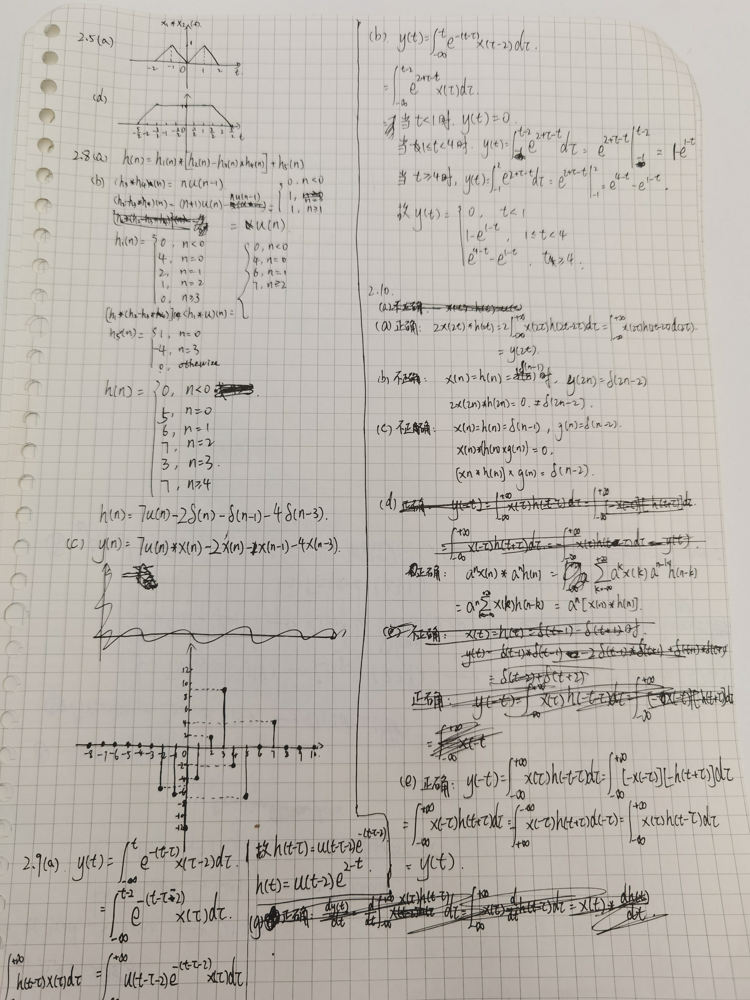

##### (f)

正确。$y(-n)=\displaystyle\sum_{k=-\infin}^{+\infin}x(k)h(-n-k)=\displaystyle\sum_{k=-\infin}^{+\infin}-x(-k)h(n+k)$

$=-\displaystyle\sum_{k=-\infin}^{+\infin}x(k)h(n-k)=-y(n)$

##### (g)

正确。$\displaystyle\frac{\mathrm{d}y(t)}{\mathrm{d}t}=\frac{\mathrm{d}}{\mathrm{d}t}\int_{-\infin}^{+\infin} x(\tau)h(t-\tau)\mathrm{d}\tau=\int_{-\infin}^{+\infin} x(\tau)\frac{\mathrm{d}h(t-\tau)}{\mathrm{d}t}\mathrm{d}\tau=x(t)*\frac{\mathrm{d}h(t)}{\mathrm{d}t}$

##### (h)

正确。$\displaystyle y(n)-y(n-1)=\left[\sum_{k=-\infin}^{+\infin}x(k)h(n-k)\right]-\left[\sum_{k=-\infin}^{+\infin}x(k)h(n-1-k)\right]$

$\displaystyle=\left[\sum_{k=-\infin}^{+\infin}x(k)h(n-k)\right]-\left[\sum_{k=-\infin}^{+\infin}x(k-1)h(n-k)\right]=\sum_{k=-\infin}^{+\infin}\left[x(k)-x(k-1)\right]h(n-k)$

$=\left[x(n)-x(n-1)\right]*h(n)$

#### 2.11

##### (a)

正确，取 $x(t)=\text{sgn}(h(t))$即可

##### (b)

错误，单位冲激响应为 $\delta(n-1)$ 的系统是因果的，其逆系统的单位冲激响应为 $\delta(n+1)$ 不是因果的。

##### (c)

错误，取 $K=1, h(n)=u(n), x(n)=u(n)$，则 $y(n)=(n+1)u(n)$ 无界

##### (d)

正确。因为 $h(n)$ 具有优先持续期，故存在 $N>0$，使得 $\forall x \not\in [-N,N], h(n)=0$，取 $M = \max _{x\in[-N,N]} \abs{h(x)}$，有 $y(n) = \sum_{k=-\infin}^{+\infin} x(n)h(n-k) \leq \sum_{k=-\infin}^{+\infin} \abs{x(n)}\abs{h(n-k)} \leq N\sum_{k=-N}^{N} \abs{x(n)}$

当 $x(n)$ 有界时，$y(n)$ 有界

##### (e)

错误，取$\displaystyle h[n]=\frac{u[n-1]}{n}, x[n]=u[-n-1]$，则 $\displaystyle \sum_{n=-\infin}^{+\infin} h^2[n] = \sum_{n=1}^{+\infin} \frac{1}{n^2}=\frac{\pi^2}{6}$，$\displaystyle y[0]=\sum_{k=-\infin}^{+\infin} h[n]x[-n]=\sum_{k=1}^{+\infin} \frac1n = +\infin$

##### (f)

错误，取 $h(n)=u(n),x(n)=1$

##### (g)

错误，取 $h_1(n)=\delta(n-2), h_2(n)=\delta(n+1)$

##### (h)

错误，该条件既不充分也不必要。当 $s(t)=u(t)$ 时， $\displaystyle\int_{-\infin}^{+\infin} s(t) \mathrm{d} t= \infin$，但系统稳定，故不必要；当 $\displaystyle s(t)=\int_{-\infin}^{+\infin}\left(\sum_{k=1}^{+\infin}u(t-f(k))-2u(t-f(k)-\frac1k)+u(t-f(k)-\frac2k)\right)\mathrm dt$ 时，$\displaystyle\int_{-\infin}^{+\infin} s(t) \mathrm{d} t= \frac{\pi^2}{6}$，但系统不稳定，故不充分，其中 $f(n)=2\sum_{k=1}^{n-1}k^{-1}$。

##### (i)

正确。若系统是因果的 则 $\forall n<0, h(n)=0$，故 $\forall n<0, s(n)=\sum_{k=-\infin}^n h(n) = 0$；若$\forall n, s(n)<0$，则 $\forall n<0, h(n) = s(n)-s(n-1) = 0$，则系统是因果的。

#### 2.12

(a) 稳定、因果

(b) 稳定、不因果

(c) 不稳定、不因果

(d) 稳定、不因果

(e) 稳定、因果

(f) 不稳定、不因果

(g) 稳定、不因果

(h) 稳定、因果

#### 2.14

$\displaystyle y_1(t)=\int_{0}^{2} h(t-\tau)\mathrm d\tau$

$h(t) = u(t)-u(t-1)$

$\displaystyle y_2(t)=\int_0^1 h(t-\tau)\sin \pi \tau \mathrm d \tau$

- 当 $t<0$ 时，$y_2(t) = 0$
- 当 $0\leq t < 1$ 时，$\displaystyle y_2(t)=\int_0^t\sin \pi \tau \mathrm d \tau = \frac1\pi(1-\cos\pi t)$
- 当 $1\leq t < 2$ 时，$\displaystyle y_2(t)=\int_{t-1}^1 \sin \pi \tau \mathrm d \tau = \frac1\pi(1-\cos\pi t)$
- 当 $t\geq 2$ 时，$y_2(t) = 0$

#### 2.15

$y(n) = \alpha y(n-1) + (1-\alpha)x(n) = \alpha^2 y(n-2) + \alpha(1-\alpha) x(n-1) + (1-\alpha) x(n)$

$ = \cdots = (1-\alpha) \sum_{k=0}^{+\infin} \alpha^k x(n-k)$

- $\alpha = 0$

  $y(n)=x(n)$

- $\alpha = \frac12$

  $y(n) = \frac12 \sum_{k=0}^{+\infin} \frac{x(n-k)}{2^k}$

  `x[] = {0,0,1,2,3,2,2,1};`

  `y[] = {0,0,1/2,5/4,17/8,33/16,65/32,97/64}`

  | t    | -4   | -3   | -2   | -1   | 0    | 1     | 2     | 3     |
  | ---- | ---- | ---- | ---- | ---- | ---- | ----- | ----- | ----- |
  | x    | 0    | 0    | 1    | 2    | 3    | 2     | 2     | 1     |
  | y    | 0    | 0    | 1/2  | 5/4  | 17/8 | 33/16 | 65/32 | 97/64 |

- $\alpha =1 $

  $y(n) = 0$